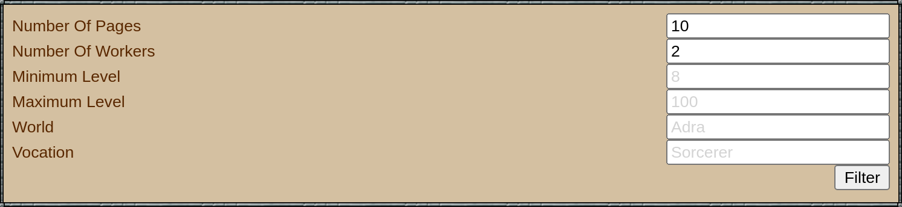

# tibia-charbazar-history-userscript

Tibia Charbazar History Filters Greasemonkey / Tampermonkey Userscript.

This project was initiated by Ziir after a [Reddit post: What Calculator or Tool do you need?](https://www.reddit.com/r/TibiaMMO/comments/jjnqw7/what_calculator_or_tool_do_you_need/).

## Prerequisites

Any web browser with a Userscript extension.

## Install

### Using Firefox

- Download [Greasemonkey for Firefox](https://addons.mozilla.org/fr/firefox/addon/greasemonkey/) or [Tampermonkey for Firefox](https://addons.mozilla.org/fr/firefox/addon/tampermonkey/).
- Download & install [tibia-charbazar-history.user.js](https://github.com/ziirgg/tibia-charbazar-history-userscript/raw/main/tibia-charbazar-history.user.js).

### Using Chomium / Chrome

- Download [Tempermonkey](https://www.tampermonkey.net/).
- Download & install [tibia-charbazar-history.user.js](https://github.com/ziirgg/tibia-charbazar-history-userscript/raw/main/tibia-charbazar-history.user.js).

## Features

This is the first working version of the userscript, so features are quite limited at the moment.
This version features a set of filters for Tibia Charbazar Auction History page, you can filter past auctions by:

### World / Server

Use the capitalized world / server name, ie: Antica

### Minimum Character Level

The minimum level of character auctions, ie: 8

### Maximum Character Level

The maximum level of character auctions, ie: 100

### Vocation

The vocation of the character auctions you're looking for.
The value input in this field will be turned into a case-insensitive [`new RegExp()`](https://developer.mozilla.org/en-US/docs/Web/JavaScript/Reference/Global_Objects/RegExp), therefore, if you input `sorcerer`, you will retrieve the auctions matching both `Master Sorcerer` and `Sorcerer`. You can also filter for multiple vocations, for example: `knight|paladin`.

## Feature Requests

I am open to feature requests, both in this repository's Issues, via Reddit or email.
Please describe your request clearly, and, if possible, include a use-case example.

## Feedback

Please send my way any feedback you might have, **by email, on Reddit, or in-game**.

## Donations & Encouragement

Feel free to send Tibia Coins to `Adraziir` :)

## License

MIT.
